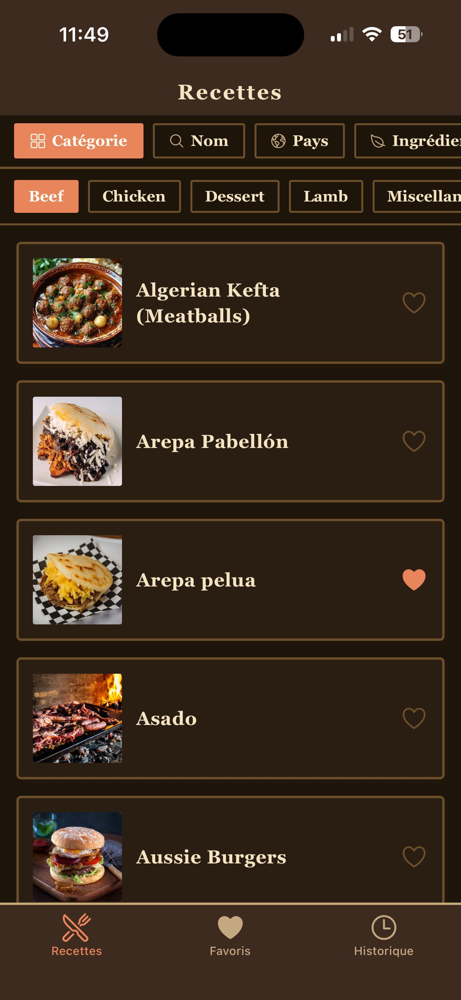
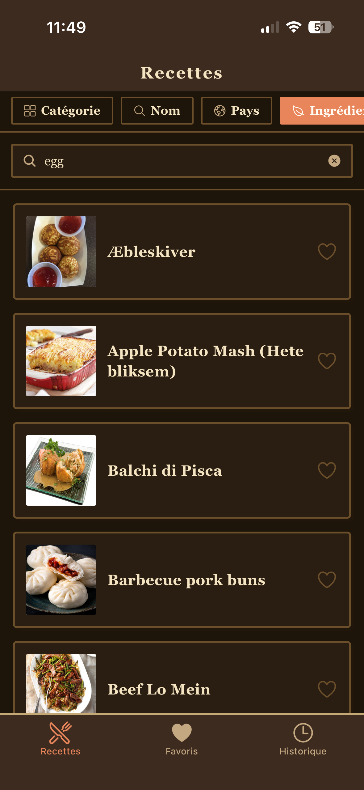
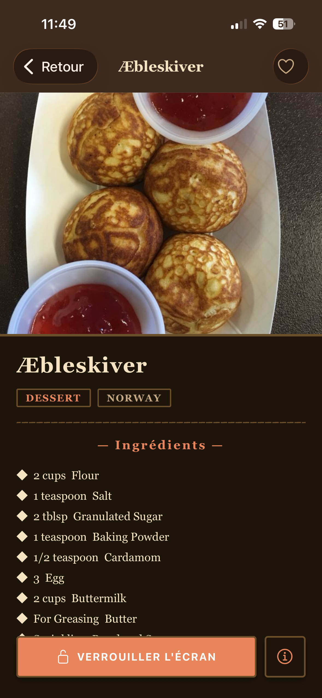
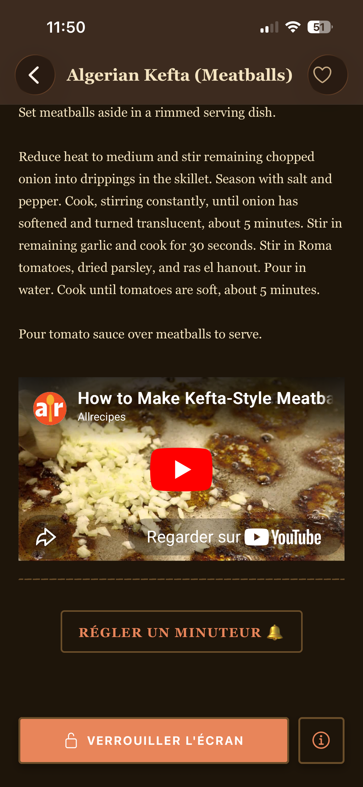
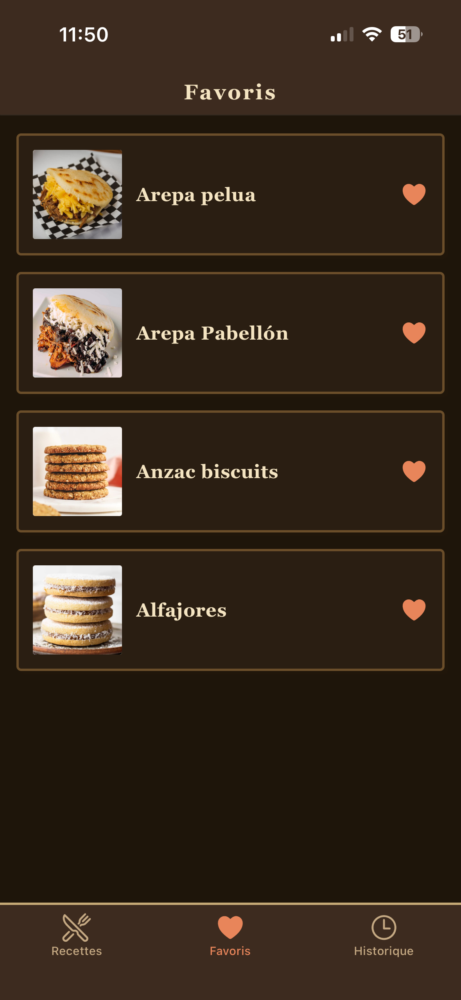
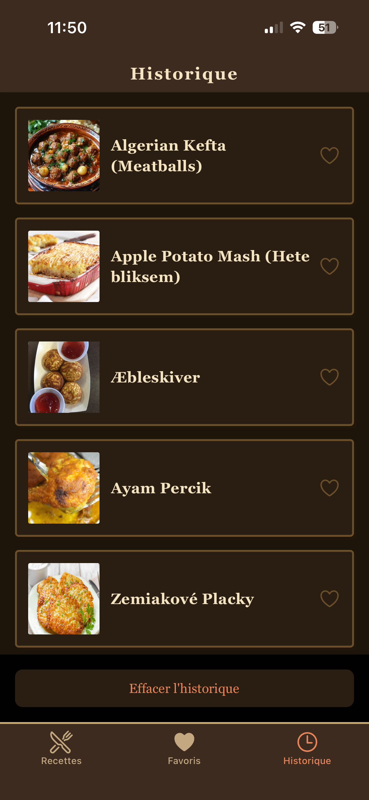
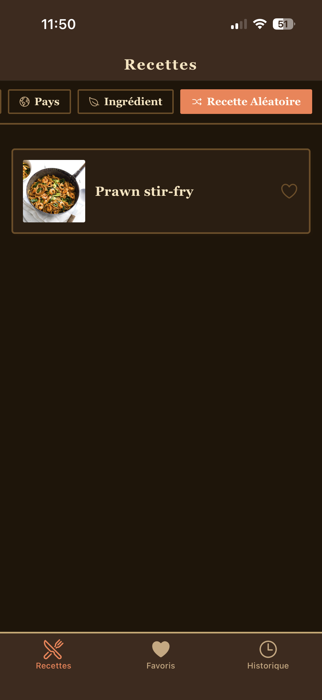

# RecetteBox 

Bienvenue sur **RecetteBox**, une application mobile moderne de découverte et de gestion de recettes de cuisine, développée avec React Native et Expo. Trouvez l'inspiration pour vos prochains repas grâce à des filtres par catégorie, pays ou ingrédient, ou laissez simplement le hasard choisir pour vous !

##  Fonctionnalités

- **Recherche avancée** : recherchez des recettes par nom, ingrédient ou pays d'origine.
- **Navigation par catégories** : explorez facilement les entrées, plats et desserts grâce à une interface intuitive.
- **Recette aléatoire** : découvrez une nouvelle idée de repas en un seul clic.
- **Favoris** : enregistrez vos recettes préférées pour les retrouver rapidement (via Redux).
- **Historique** : consultez les dernières recettes visitées.
- **Mode sombre & thème rétro** : une interface élégante avec une typographie serif adaptée aux préférences système.
- **Fiches recettes complètes** : accédez à la liste des ingrédients, aux instructions détaillées, aux vidéos de préparation et à un minuteur intégré.

---

##  Technologies utilisées

- **Framework** : React Native avec Expo (SDK 51+)
- **Navigation** : Expo Router (routage basé sur les fichiers)
- **Gestion d'état** : Redux Toolkit (slices pour les recettes, favoris et historique)
- **UI & Icônes** : thème rétro personnalisé et `@expo/vector-icons` (Ionicons)
- **API** : intégration avec l'API publique TheMealDB

---

##  Installation

### 1. Cloner le dépôt

```bash
git clone https://github.com/Ayrazia/RecetteBox.git
cd RecetteBox
```

### 2. Installer les dépendances

```bash
npm install
```

### 3. Lancer l'application

```bash
npx expo start
```

Depuis Expo, vous pourrez ouvrir l'application sur :

-  Expo Go (via QR Code)
-  Un émulateur Android
-  Un simulateur iOS
-  Un navigateur web (touche `w`)

---

##  Structure du projet

```plaintext
├── app/
│   ├── tabs/index.tsx
│   ├── tabs/history.tsx
│   ├── tabs/_layout.tsx
│   ├── meal/[id].tsx
│   ├── category/[id].tsx
│   └── _layout.tsx

├── components/
├── constants/
├── features/
└── redux/
```

---

##  Réinitialiser le projet

```bash
npm run reset-project
```

Cette commande déplacera le code actuel dans un dossier `app-example` et générera un nouveau dossier `app` vide.

---


<p>
  
    
      
        
          
            
              
</p>
## 🤝 Contribution

Les contributions, suggestions et rapports de bugs sont les bienvenus.

---


Développé par **Ayrazia**.
